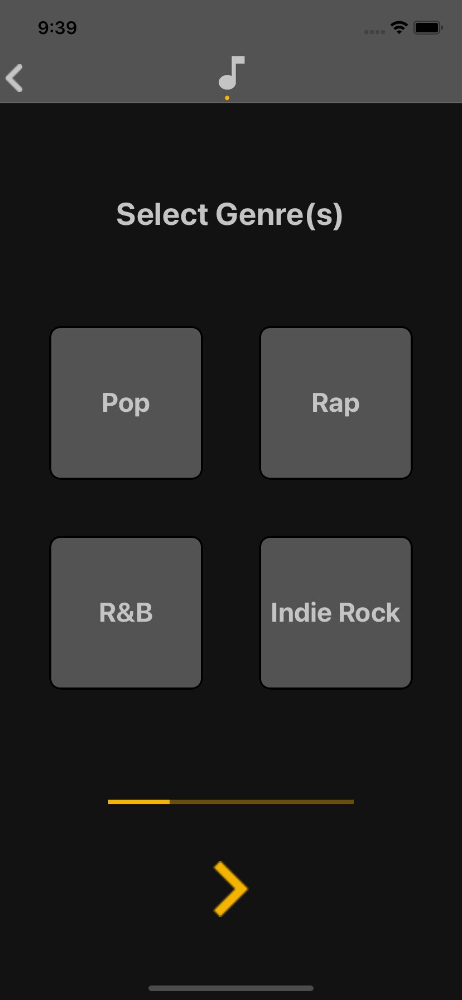
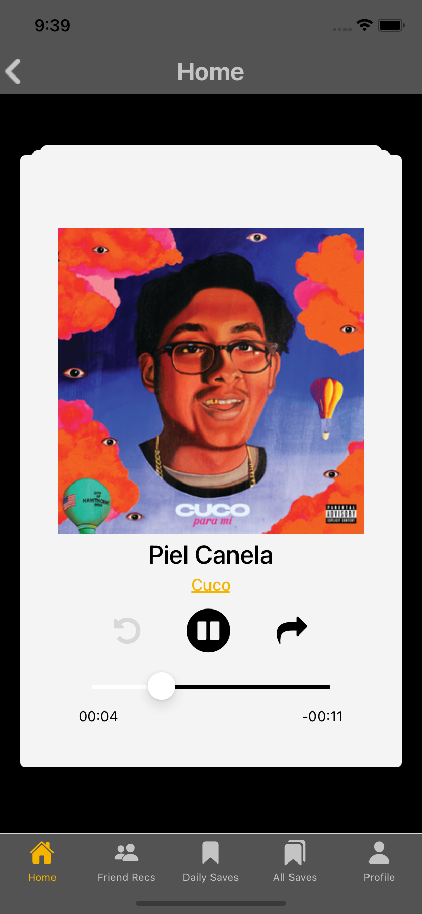
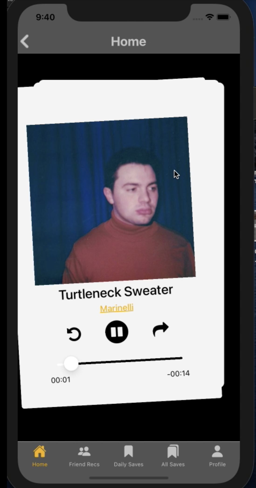

# CS147 Final Project

In this class, our primary goal is to by a need relating to Arts & Culture, and then based off of a robust set of tests, interviews, prototypes, we configure a final, high-fidelity prototype. This prototype's primary purpose is to demonstrate what need we found and how we decided to tackle said need. 

For this class, my teammates Josh, Ben, and myself interviewed several people and concluded that people have a difficulty finding good, new music. 
We then formulated and test our assumption that people who listen to popular music can figure out whether they like or dislike a song in 15 seconds. 

We built off of this assumption and finally built out a prototype, begrudgingly using Expo to supposedly expedite the mobile development process. In this project, we use Expo's Audio Player, Redux, and standard React Native UI components. 

In essence, we built a Tinder-style app where users can swipe through a deck of 'cards' which are audio files of 15 seconds (cut to 15 dynamically) pre-loaded by us. Due to time constraints, the code is extremely messy and there is a lack of API involvement i.e. no Spotify API to load songs in.

Swiping right meant the user liked the song; the song gets added to a queue which can be exported to Spotify as a playlist. 

Swiping left meant the user did not like the song; continue to next card.

Below are pictures of how our prototype functioned: 

 

 

